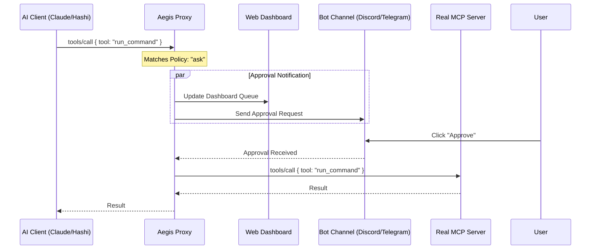

# Project Aegis Architecture (v2) 🛡️

## Overview
**Project Aegis** (formerly MCP Firewall) is a Universal Security Control Plane for AI Agents. It sits between an AI Client (like Hashi or Claude) and MCP Servers, providing a secure layer for tool proxying, skill auditing, and dependency scanning.

## Core Design
Aegis acts as a Man-in-the-Middle (MITM) proxy for the Model Context Protocol, enforcing granular security policies.

## Modules

### 1. Proxy Core (`pkg/proxy`)
- Manages IO streams (Stdio/SSE/WebSocket).
- Handles JSON-RPC 2.0 parsing and buffering.
- **Interception Logic:** Buffers `tools/call` and pauses the stream until a verdict is reached.

### 2. Policy Engine (`pkg/policy`)
- Determines the action: `allow`, `deny`, `ask`, or `log`.
- **Granular Rules:** Matches by tool name patterns and CEL (Common Expression Language) conditions on arguments.
- **Hot-Reloading:** Watches `aegis.yaml` for changes without downtime.

### 3. Human-in-the-Loop (HITL)
- **Web Dashboard:** A local management UI for visibility and quick approvals.
- **Messaging Adapters:** 
    - **Discord/Telegram:** Integration with existing bot channels for remote approval.
    - **Minato Native:** Uses Minato as the channel bridge for Discord/Telegram/web approval flows.

### 4. Skill Auditor (`pkg/audit/skill`)
- Scans `SKILL.md` files for prompt injection or malicious instructions before they are loaded by the agent.
- **On-Demand Scanning:** Audits skills as they are discovered or requested.

### 5. Registry & Metadata (`pkg/registry`)
- Stores "Local Trust" records—once a version of a tool or skill is verified, it is cached as safe.
- Manages MCP server registration and discovery.

## Roadmap
1.  **Phase 1 (Shield):** Stdio Proxy + JSON-RPC Interceptor + CLI.
2.  **Phase 2 (Dashboard & Channels):** Web UI + Discord/Telegram adapters for remote approval.
3.  **Phase 3 (Aegis Auditor):** Static analysis of Skill files and prompt safety checks.
4.  **Phase 4 (Kura Integration):** Centralized storage of audit logs and trusted fingerprints in Project Kura.
