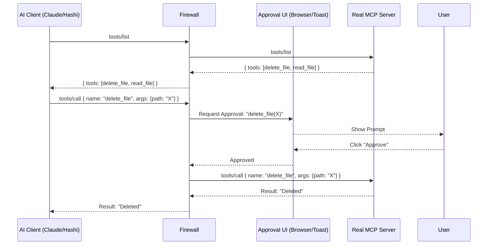

# MCP Firewall Architecture

## Core Design
The Firewall is a **Man-in-the-Middle (MITM)** proxy for the Model Context Protocol.



## Modules

### 1. Proxy Core (`pkg/proxy`)
- Handles the JSON-RPC traffic.
- Parses incoming messages.
- Decides whether to **Pass Through** (e.g., `ping`, `list_tools`) or **Intercept** (`call_tool`).

### 2. Policy Engine (`pkg/policy`)
- Not all calls need approval.
- Supports a `policy.yaml`:
    ```yaml
    rules:
      - tool: "read_*"
        action: allow
      - tool: "delete_*"
        action: ask
    ```

### 3. Approval Server (`pkg/server`)
- Runs a lightweight HTTP server (e.g., port `9090`).
- Provides an API for the UI to poll/push notifications.
- **Interaction Adapters (Plugins):**
    - **OpenClaw Bridge:** Detects if running inside OpenClaw; uses native `message` tool with Inline Buttons.
    - **Desktop:** Native Toast notification ("Click to Review").
    - **Direct Telegram:** Acts as a standalone bot if tokens are provided.
    - **Fallback:** "Reply YES to approve" (for CLI/SMS).

## Deployment Modes

### 1. Local Proxy (Desktop Security)
Use with **Hashi** or direct Codex/Claude usage.
- Runs on: User's Laptop.
- Protects: Local Files, Local Shell.
- Approval: Toast Notification / Local Web.

### 2. Sidecar (Agent Security)
Use with **OpenClaw/BMO**.
- Runs on: The Agent's Host (Raspberry Pi/Cloud).
- Protects: The Agent's tools (e.g., prevent BMO from deleting its own memory).
- Approval: **Telegram Message** to the owner.

## Technology Stack
- **Language:** Go (High performance, strong concurrency for handling IO pipes).
- **Library:** `gliderlabs/ssh` or standard `jsonrpc`.

## Roadmap
1.  **v0.1:** Blind Proxy (Pass-through only).
2.  **v0.2:** Interceptor (Log requests to file).
3.  **v0.3:** Blocker (Wait for API approval).
4.  **v0.4:** Web UI.
