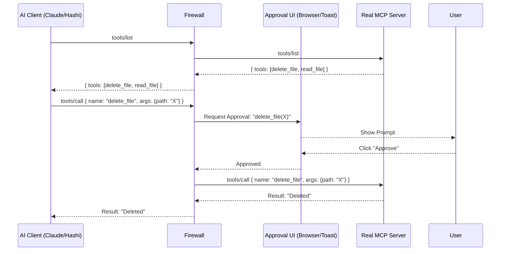

# MCP Firewall Architecture

## Core Design
The Firewall is a **Man-in-the-Middle (MITM)** proxy for the Model Context Protocol.



## Modules

### 1. Proxy Core (`pkg/proxy`)
- Handles the JSON-RPC traffic.
- Parses incoming messages.
- Decides whether to **Pass Through** (e.g., `ping`, `list_tools`) or **Intercept** (`call_tool`).

### 2. Policy Engine (`pkg/policy`)
- Not all calls need approval.
- Supports a `policy.yaml`:
    ```yaml
    rules:
      - tool: "read_*"
        action: allow
      - tool: "delete_*"
        action: ask
    ```

### 3. Approval Server (`pkg/server`)
- Runs a lightweight HTTP server (e.g., port `9090`).
- Provides an API for the UI to poll/push notifications.
- Provides a Web Interface (`http://localhost:9090/approve`) for the user to click buttons.

### 4. Transports
- **Upstream (Target):** Connects to the real server via Stdio (executing the binary).
- **Downstream (Client):** Listens on Stdio (where the AI connects).

## Technology Stack
- **Language:** Go (High performance, strong concurrency for handling IO pipes).
- **Library:** `gliderlabs/ssh` or standard `jsonrpc`.

## Roadmap
1.  **v0.1:** Blind Proxy (Pass-through only).
2.  **v0.2:** Interceptor (Log requests to file).
3.  **v0.3:** Blocker (Wait for API approval).
4.  **v0.4:** Web UI.
