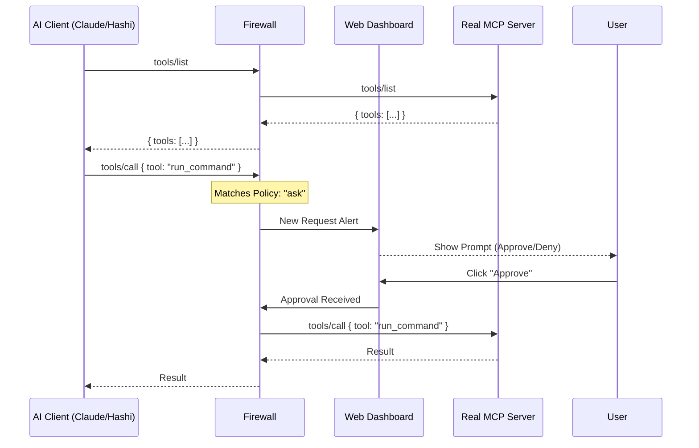

# MCP Firewall Architecture (v2)

## Overview
The MCP Firewall is a Man-in-the-Middle (MITM) proxy for the Model Context Protocol. It sits between an AI Client (like Hashi or Claude) and an MCP Server, providing a secure layer for policy enforcement, human approval, and visibility.

## Core Design
The Firewall intercepts JSON-RPC traffic on Stdio or SSE.



## Modules

### 1. Proxy Core (`pkg/proxy`)
- Manages the IO streams (Stdio/SSE).
- Handles JSON-RPC parsing and buffering.
- **Interception Logic:** Buffers tool calls and pauses the stream until the Policy Engine or Human provides a verdict.

### 2. Policy Engine (`pkg/policy`)
- Determines the action for every request: `allow`, `deny`, `ask`, or `log`.
- **Log Mode:** For specific endpoints, the Firewall forwards the call immediately but sends a "notification-only" log to the configured channel (e.g., Telegram) without blocking.
- **Granular Rules:** Rules can be applied at the server, tool, or even argument level.

### 3. Web Dashboard & Management (`pkg/web`)
- A local web interface (e.g., `:9090`) to manage the firewall state.
- **Visibility:** List all registered MCP servers and their available tools (Discovery).
- **Control:** Live approval queue for "ask" actions.
- **Configuration:** Add/Remove MCP servers and edit tool policies through the UI.
- **Documentation:** Automatic generation of documentation for registered MCPs based on their `tools/list` schema.

### 4. Registry & CLI (`pkg/registry`)
- **MCP Registration:** Add new servers via `mcp-firewall register -- <command>`.
- **Rule Setup:** During registration, the user is prompted to set the initial policy (Default Allow, Default Ask, or per-endpoint rules).
- **Persistence:** Configuration is stored in a local SQLite or YAML store.

## Policy Configuration
Policies can be managed via the Web UI or a `policy.yaml`:
```yaml
servers:
  - id: "filesystem"
    default_action: "ask"
    tools:
      - name: "read_file"
        action: "allow"
      - name: "write_file"
        action: "ask"
      - name: "list_directory"
        action: "log" # Notifies the user but doesn't block
```

## Interaction Adapters
- **Local Web:** For desktop usage.
- **Telegram (Sora-Link):** For remote/headless usage via OpenClaw.
- **Desktop Toasts:** Integration with OS notification systems.

## Roadmap (Updated)
1.  **Phase 1 (Core):** Stdio Proxy + JSON-RPC Interceptor + CLI registration.
2.  **Phase 2 (Web & Policy):** Web Dashboard + Granular Endpoint Policies + "Log-only" mode.
3.  **Phase 3 (Discovery):** Auto-generated documentation and advanced auditing.
