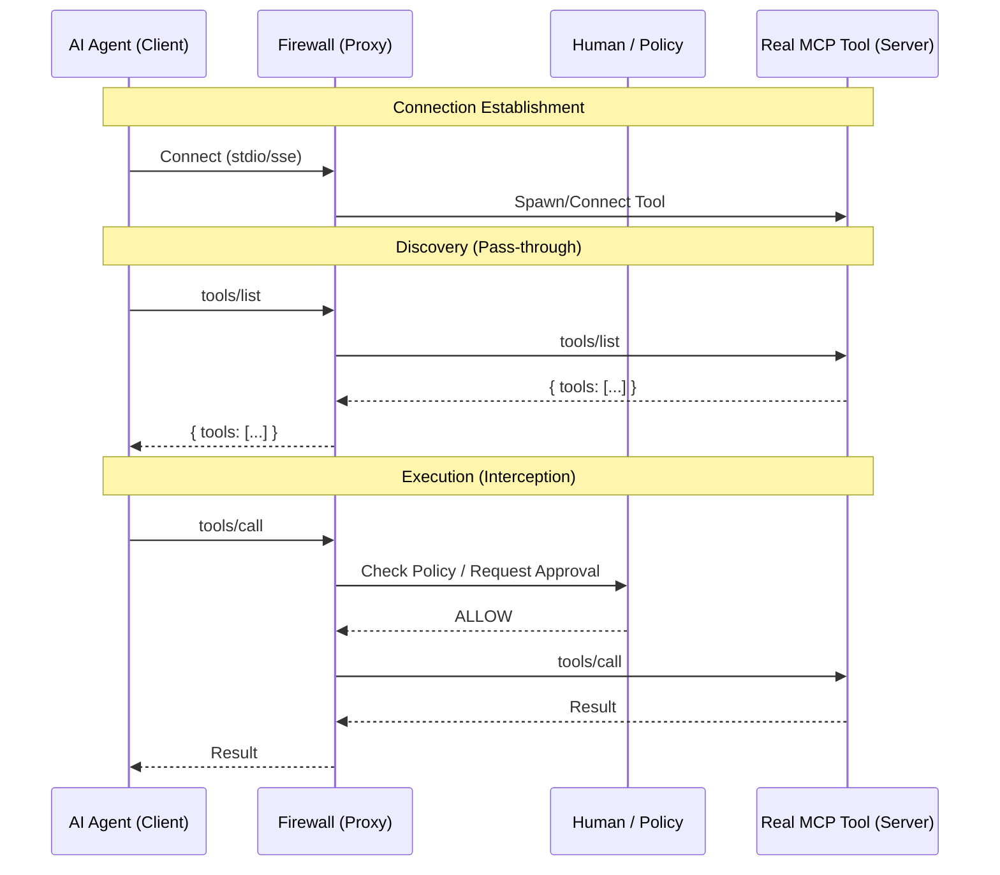

# MCP Firewall Architecture

## 1. The Proxy Model
The MCP Firewall operates as a **Man-in-the-Middle (MITM)** proxy between the **Client** (the AI Agent, e.g., OpenClaw, Codex, Claude Desktop) and the **Server** (the MCP Tool).

Instead of the Client connecting directly to a tool, it connects to the Firewall. The Firewall manages the connection to the actual tool, inspecting and controlling the traffic in real-time.



---

## 2. Phased Approach

We are building this in two distinct phases. Phase 1 focuses on immediate security needs, while Phase 2 expands into a comprehensive tool management platform.

### Phase 1: The Transparent Shield (MVP)
**Goal:** Pure Security & Observability.
**Philosophy:** "Add security without changing how tools are installed."

In this phase, the Firewall is a **transparent wrapper**. It does not manage installation, dependencies, or configuration. It assumes the user has already installed the tool (e.g., via `npm` or `pip`).

*   **Usage:**
    *   Old: `npx -y @modelcontextprotocol/server-filesystem /path`
    *   New: `mcp-firewall run -- npx -y @modelcontextprotocol/server-filesystem /path`
*   **Key Features:**
    *   **Pass-Through Proxy:** Forwards all stdin/stdout by default.
    *   **Interception:** Pauses `tools/call` requests based on policy.
    *   **Approval UI:** Simple approval mechanism (CLI confirmation, local HTTP endpoint, or Telegram message).
    *   **Stateless:** No database, no complex configuration files (just a simple `policy.yaml`).

### Phase 2: The Agentic Hub (Target State)
**Goal:** Management, Discovery & Aggregation.
**Philosophy:** "One endpoint for everything."

In this phase, the Firewall evolves into a **Tool Manager (Shop)**. It abstracts away the complexity of managing multiple MCP servers, environments, and API keys.

*   **Architecture Change:**
    *   The Client connects to **one** Firewall endpoint (e.g., `ws://localhost:9090`).
    *   The Firewall aggregates tools from multiple downstream servers into a single `tools/list`.
*   **Key Features:**
    *   **Profiles:** Define sets of tools (e.g., `profile: coding` includes Filesystem + Git; `profile: research` includes Brave + Fetch).
    *   **Package Manager:** The Firewall handles installing tools (e.g., `mcp install @smith/git`).
    *   **Vault (Secrets):** Centralized storage for API keys. The Client never sees the keys; the Firewall injects them when spawning the tool.
    *   **Tool Discovery:** Browse and install tools from a registry.

---

## 3. Technical Design (Phase 1)

### Modules

#### 1. Core Proxy (`pkg/proxy`)
- **Transport Agnostic:** Supports Stdio and SSE.
- **Message Loop:** Decodes JSON-RPC 2.0 messages.
- **Inspector:** Examines method names (`tools/call`, `resources/read`).

#### 2. Policy Engine (`pkg/policy`)
- Loads `policy.yaml`.
- Determines action: `ALLOW`, `DENY`, `ASK`.
- **Granularity:** Can filter by Tool Name and Argument Values (e.g., "Allow `read_file` only if path starts with `/tmp`").

#### 3. Approval Adapters (`pkg/approval`)
The mechanism for asking the human.
- **Local:** Terminal prompt (Y/n).
- **Desktop:** Native OS notification (Toast) or Localhost Web UI.
- **Remote:** Webhook/Telegram integration (for headless agents like OpenClaw).

### Configuration (`firewall.yaml`)
```yaml
version: "1"
policy:
  default: ask
  rules:
    - tool: "read_*"
      action: allow
    - tool: "write_file"
      action: ask
      condition: "path != '/etc/*'"

approval:
  method: "telegram" # or "stdio", "http"
```
